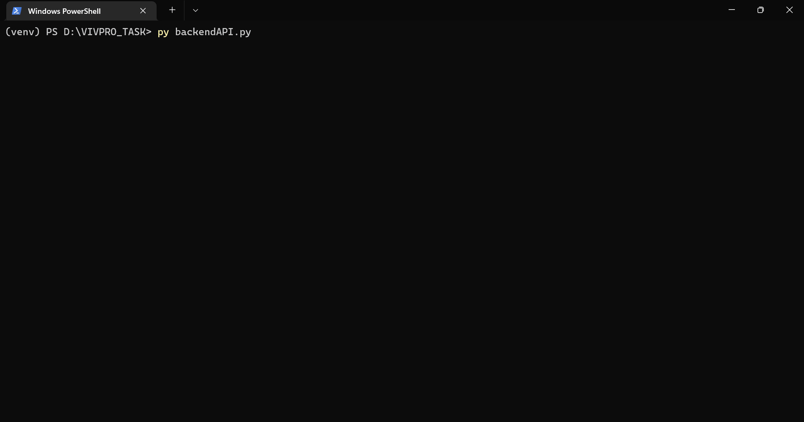
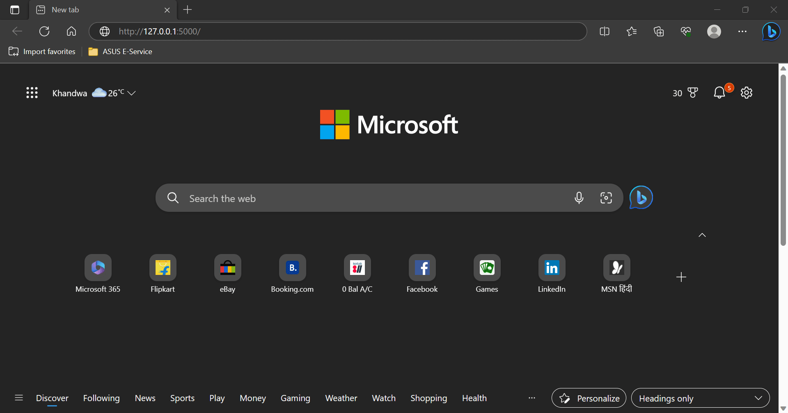
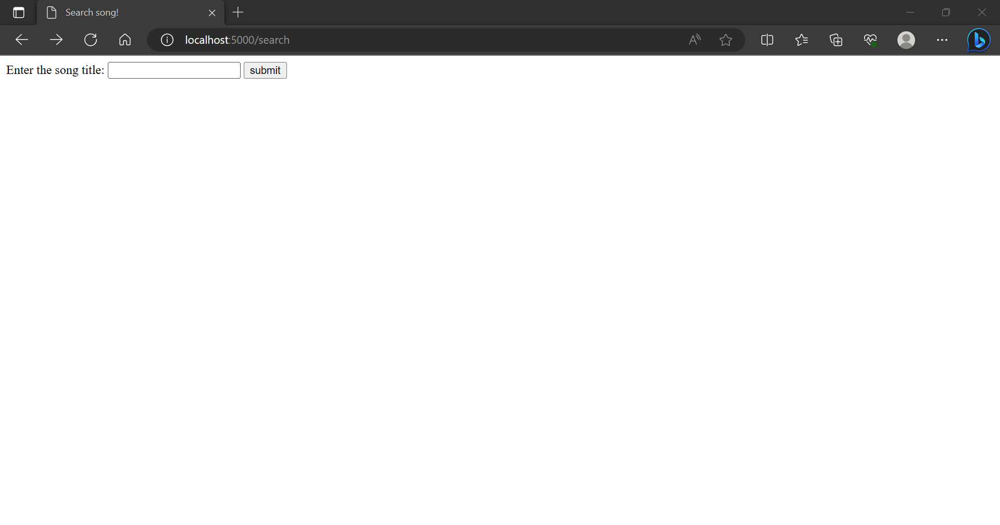
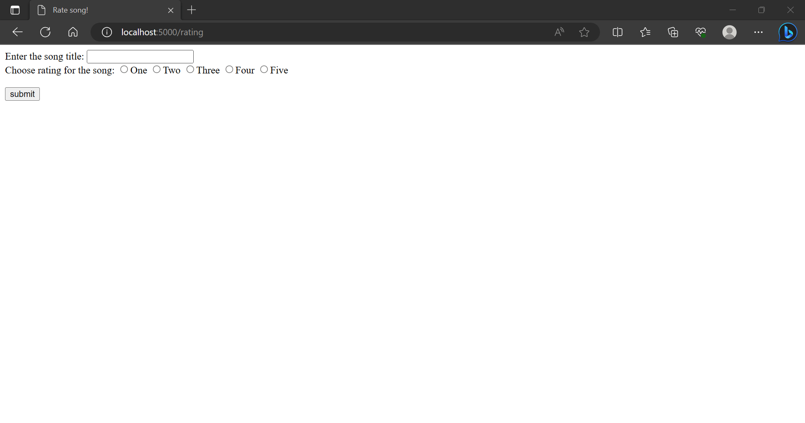

# VIVPRO HOME TASK
### Task 1: 
#### Data Processing
The provided dataset of songs in JSON format has been processed to incorporate the data into an SQLite database.
The steps undertaken were as follows:

- The JSON file named "playlist.json" was imported and processed, resulting in the creation of a Python dictionary.
- All the keys and values within the dictionary were extracted.
- To accommodate the data, an SQLite database named "songs" was established. This database would contain a table named "playlist".
- The data from the dictionary was systematically inserted into the "playlist" table using an iterative approach.
- To conclude the process, the connection to the database was properly closed.

#### Instructions to run
Open python terminal in same directory and type below command
```
py dataProcess.py
```


### Task 2: 
#### API to serve normalised data [Backend]

The database that was created in the previous task will now be utilized to respond to requests through an API built with Flask.
Here's how the process was carried out:

- The Flask framework was imported in order to set up an API.
- A connection was established to the "songs" database that was created in the earlier task.
- A route was defined for the index page. This route is responsible for showcasing the data of all the songs in the playlist. The data is presented in JSON format.
- Another route was set up for the search page. This route enables the display of all attributes of a song. 
- This display is based on the input provided through a form, which processes the information according to the title of the song.
- Lastly, a route was established for the rating page. This particular route allows users to assign ratings to the songs present in the playlist.


#### Instructions to run
Open the Python terminal in the same directory and enter the following command:
```
py backendAPI.py
```


Then, open any web browser and navigate to the following URL to access the index page:
```
http://localhost:5000/
```


To access the search page, use the following URL:
```
http://localhost:5000/search
```


To access the rating page, use the following URL:
```
http://localhost:5000/rating
```


#### Compatibility
This code has been developed and tested well in Windows in the virtual python environment.

by Siddharth Mishra